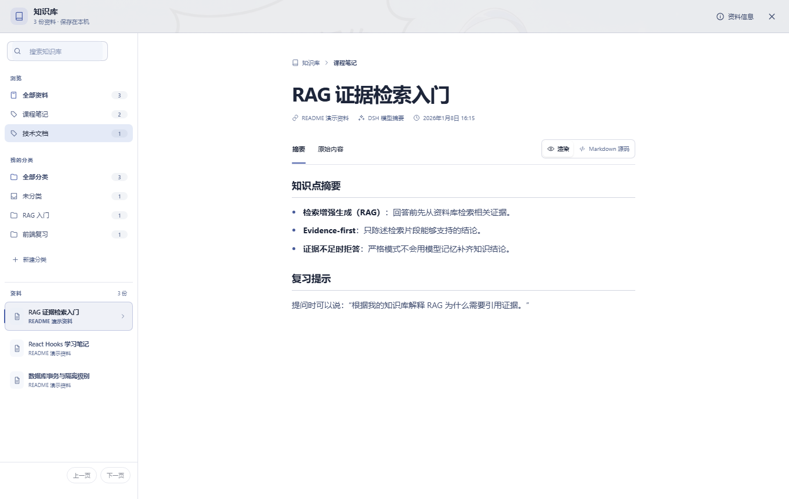
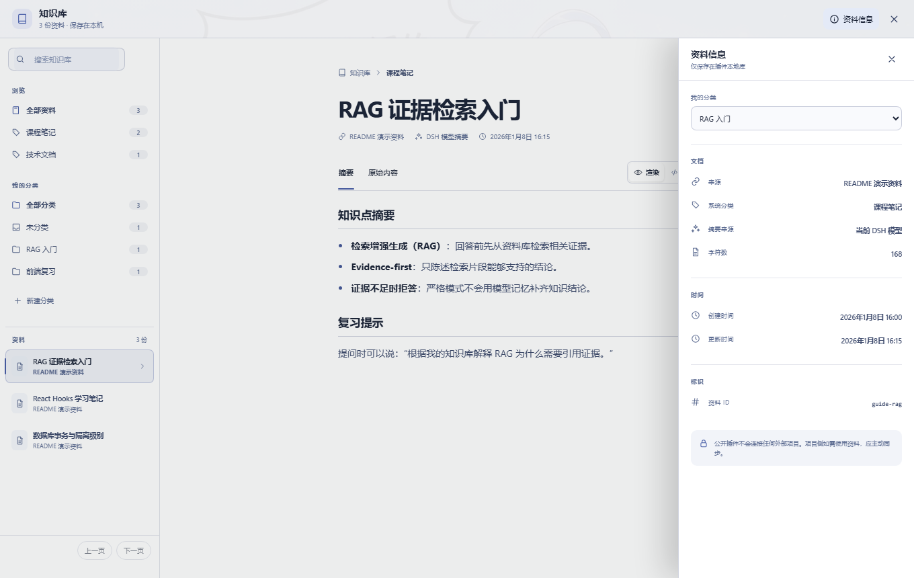

# dsh-project-knowledge-review

一个面向中文 DSH 用户的独立本地知识复习插件。

它把文字资料、OCR 图片文字和 ASR 音频转写保存到 DSH 用户目录，在回答知识问题前先检索本地 evidence；严格模式下没有足够证据就明确拒答。插件不需要数据库、向量模型、账号登录或项目 Token，也不会连接、安装或识别任何外部项目。

## 主要能力

- 零配置本地资料库：首次使用时自动创建 v2 存储。
- Evidence-first 问答：先检索，再根据 evidence 回答；严格模式证据不足即拒答。
- 当前 DSH 模型作答：插件只提供检索 evidence 和系统约束，最终答案仍由当前会话模型生成。
- Markdown 摘要：文字、OCR、ASR 入库后立即生成 Markdown 自动提要；自动过滤导入元数据、RAG 模板和纯时间戳，也可用当前 DSH 模型回写更好的 Markdown 摘要。
- 两级分类：插件自动生成系统初分类，用户可在知识库页面建立并调整自己的二次分类。
- 一级知识库页面：侧栏点击“知识库”进入独立工作区，可查看详细摘要和详细原始内容。
- 安全 Markdown 预览：摘要与原始内容都支持渲染视图和 Markdown 源码视图；不执行 HTML 或脚本。
- 可选 OCR / ASR：默认关闭，只有用户显式开启并配置 DSH 凭据后才访问对应服务。
- 大库友好：轻量 JSONL 索引、单文档原文文件、游标分页和按需原文读取。
- 键盘友好：阅读标签支持方向键切换，抽屉支持 Escape 关闭与焦点返回，并遵循“减少动态效果”偏好。
- v1 自动迁移：旧版整库 JSON 会迁移到 v2，并保留不可覆盖的原始备份。

## 3 分钟快速上手

### 第 1 步：安装插件

```bash
dsh plugin --profile web add dsh-project-knowledge-review
```

安装后重新启动当前 DSH Web 进程并刷新页面。成功后可以看到：

- 侧栏出现“知识库”，位置在“工作区”上方；
- “设置”页面出现“知识复习”；
- 新会话可以使用 `project_knowledge_*` 工具。

第一次使用不需要配置数据库、向量模型、账号或 Token。默认使用“知识库仅供参考”：仍会先检索本地资料，再把知识库证据与模型补充分区展示。

```text
回答策略：reference
资料库：~/.dsh/project-knowledge-review/knowledge.json
OCR：关闭
ASR：关闭
```

### 第 2 步：添加第一份资料

在任意 DSH 对话中直接粘贴你有权使用的文字，例如：

```text
把下面内容加入知识库，标题是“RAG 证据检索入门”，来源是“我的学习笔记”：

RAG 在生成回答前先检索资料库。严格模式要求回答引用资料标题与来源；
当前知识库没有足够证据时，应明确拒答。
```

插件会调用 `project_knowledge_add_text`，保存原文并返回：

- 资料 ID；
- Markdown 自动提要；
- 摘要来源；
- 系统初分类；
- 本地保存结果。

> 请只导入自己编写、公开授权或已确认有权使用的资料。

### 第 3 步：打开知识库阅读

点击侧栏“知识库”，即可搜索资料、按系统分类或个人分类浏览，并在“摘要 / 原始内容”和“渲染 / Markdown 源码”之间切换。



界面分为三个按需区域：

- 左侧资料导航：搜索、系统分类、个人分类和资料列表；
- 中间阅读画布：显示完整摘要或按需读取原始内容；
- 右侧资料信息：点击顶部“资料信息”后打开，不会永久挤占正文。

### 第 4 步：建立自己的分类

在左侧点击“新建分类”，创建例如“RAG 入门”“前端复习”等目录。选择一份资料后，打开“资料信息”，即可修改“我的分类”。



系统初分类用于解释插件最初如何归类；“我的分类”由你控制，两者互不覆盖。

### 第 5 步：基于证据复习

回到对话后这样提问：

```text
根据我的知识库解释 RAG 为什么需要引用证据。
```

插件会先调用 `project_knowledge_search`。只有返回了 evidence，当前 DSH 模型才会基于证据回答，并引用资料标题与来源。

默认 `reference` 模式会固定区分：

```text
## 知识库内容
基于本地 evidence 的结论；未命中时明确说明知识库没有相关资料。

## 模型补充
当前模型提供的通用知识，不冒充知识库结论。
```

如果你希望资料里没有答案就完全拒答，可以在“设置 → 知识复习”切换为 `strict`。

## 常用操作速查

| 想做什么 | 对 DSH 说什么 |
| --- | --- |
| 添加文字资料 | `把下面内容加入知识库，标题是“……”：……` |
| 基于知识库复习 | `根据我的知识库解释……` |
| 查看资料数量 | `我的知识库有多少份资料？` |
| 查看保存位置 | `知识库资料保存在哪里？` |
| 检查项目隔离 | `知识库是否与当前项目共享？` |
| 改进自动提要 | `请根据这份资料生成更准确的 Markdown 摘要并回写` |

查询数量、标题、来源、存储位置或共享范围时，插件调用 `project_knowledge_overview`。作用域始终是当前 DSH 用户的本地资料库，`sharedWithCurrentProject` 始终为 `false`。

## 知识库页面行为

“知识库”入口采用与“任务看板”一致的侧栏按钮规格，并固定放在“工作区”区块之前。知识库打开后，点击任意对话、设置、任务看板、SSH、文件树或其他外部功能都会自动退出知识库，并让原点击继续生效。任务看板或 SSH 打开时点击知识库，也会在同一次点击中退出原面板并进入知识库；从知识库点击任务看板或 SSH 也能单击反向切换。

窄屏下，资料导航和资料信息会变成抽屉，正文使用完整可用宽度。阅读标签支持方向键切换，抽屉支持 Escape 关闭与焦点返回。

页面只借鉴主流文档与知识产品的信息架构，不复制第三方品牌或素材。

## 回答策略

### `strict`

- 知识问题必须先检索。
- 只有 `answerStatus=ANSWERED` 且 evidence 非空时才能回答。
- 只陈述 evidence 支持的结论。
- 没有证据时必须明确说明：`当前知识库中没有足够证据，不能回答`。
- 不使用模型记忆补齐知识结论。

### `reference`（默认，界面显示“知识库仅供参考”）

- 仍先检索知识库。
- 允许当前模型补充通用知识。
- 必须明确区分“知识库证据”和“模型补充”。

可以在“设置 → 知识复习”中切换策略。

## 工具

插件公开以下 DSH 工具：

| 工具 | 用途 |
| --- | --- |
| `project_knowledge_overview` | 查询数量、标题、来源、存储位置、作用域和共享状态 |
| `project_knowledge_search` | 检索本地 evidence |
| `project_knowledge_add_text` | 添加用户提供或确认有权使用的文字资料 |
| `project_knowledge_update_summary` | 用当前 DSH 模型生成的 Markdown 摘要更新一份资料 |
| `project_knowledge_import_image_ocr` | 对公开图片 URL 执行 OCR 后入库 |
| `project_knowledge_import_audio_asr` | 对公开直链音频执行 ASR 后入库 |

工具名为了保持已有 DSH 会话兼容而保留 `project_knowledge_*` 前缀；这不表示插件会连接任何外部项目。

## 本地 v2 存储

默认路径：

```text
~/.dsh/project-knowledge-review/knowledge.json
```

同目录还会出现：

```text
knowledge.json                         # 常数大小 manifest
knowledge.json.index.jsonl             # 元数据与检索 token 轻量索引
knowledge.json.documents/              # 每份资料一个 JSON 原文文件
knowledge.json.categories.json         # 用户二次分类
knowledge.json.locks/                   # 多进程 ticket 锁
knowledge.json.journal.json             # 中断恢复日志，仅写入期间存在
knowledge.json.v1.backup*.json          # v1 迁移备份（如有）
```

v2 的设计目标：

- 列表和概览不加载全量原文。
- 原文按单条 ID 哈希文件名直接定位。
- 写入和元数据更新使用跨进程 ticket 锁。
- journal 中断恢复保持清单、JSONL 索引和单条原文一致。
- 单次预览、请求体和媒体文件均有大小限制。

## OCR 与 ASR

OCR / ASR 默认关闭。启用步骤：

1. 打开“设置 → 知识复习”。
2. 开启对应服务。
3. 配置 Base URL 与模型名称。
4. 将 API Key 保存到 DSH 凭据库。

安全边界：

- 只接受公开 HTTP(S) 图片 URL，或公开可直接下载的音频 URL。
- 拒绝 URL 用户信息、非 HTTP(S) 协议、本机地址和私有网络地址。
- API Key 不写入插件设置 JSON，也不会回显。
- 插件不自动处理视频网页分享页；请提供字幕文字或公开音频直链。

## 设置项

| 设置 | 默认值 | 说明 |
| --- | --- | --- |
| `enabled` | `true` | 关闭后工具和提示词保持静默 |
| `answerPolicy` | `reference` | 默认“知识库仅供参考”；可切换为严格 `strict` |
| `localStorePath` | `~/.dsh/project-knowledge-review/knowledge.json` | 插件自己的本地资料库 |
| `projectName` | `我的知识库` | 用户可见名称；仅是命名，不是外部项目 |
| `requestTimeoutMs` | `120000` | OCR / ASR 请求超时 |
| `ocrEnabled` | `false` | 是否启用 OCR |
| `ocrBaseUrl` | DashScope OpenAI 兼容地址 | OCR 服务地址 |
| `ocrModel` | `qwen-vl-ocr` | OCR 模型 |
| `ocrApiKeyEnv` | `DSH_KNOWLEDGE_OCR_API_KEY` | DSH 凭据引用名 |
| `asrEnabled` | `false` | 是否启用 ASR |
| `asrBaseUrl` | OpenAI API 地址 | ASR 服务地址 |
| `asrModel` | `whisper-1` | ASR 模型 |
| `asrApiKeyEnv` | `DSH_KNOWLEDGE_ASR_API_KEY` | DSH 凭据引用名 |

## 隐私与发布边界

- 插件独立发布、独立运行、独立存储。
- 插件没有项目 URL、项目 API Key、配对码、能力文件或项目安装逻辑。
- 插件不会主动向外部项目同步资料。
- 插件摘要和分类只属于插件本地库。
- 如果个人项目希望使用这些资料，应由该项目在自己的服务端实现主动、只读同步；这不属于本插件的公共能力。

## 开发

```bash
npm install
npm test
npm run typecheck
npm pack --dry-run
```

`npm test` 会先清理并重建 `lib/`，防止删除过的旧功能残留在发布包中。

## License

MIT
